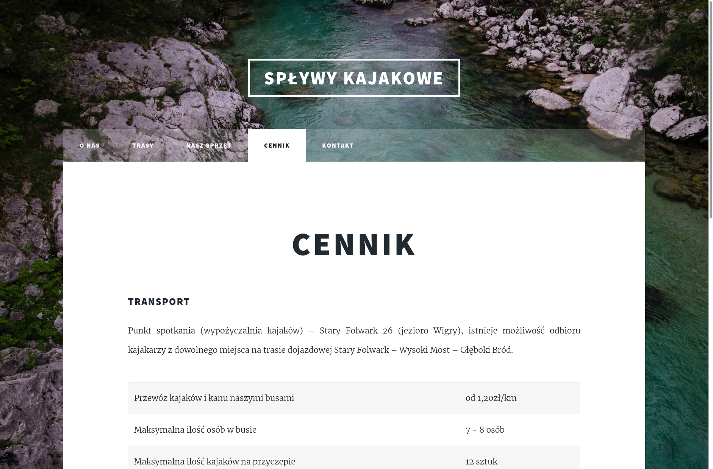
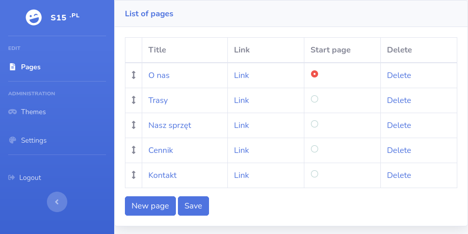
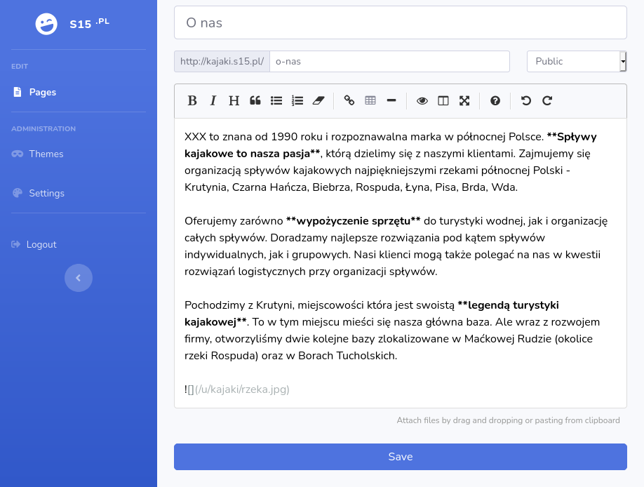

# s15

Your **s**ite in **15** minutes.

s15 is a dead simple CMS that your mom can handle.

Features

- Text based content editor (Markdown)
- Multi domain support
- Drag & drop image insertion
- Easy to create and customize template system
- Build-in responsive templates

Screenshots








## For developers

### Installation

Python packages

    pip install -r src/requirements.txt

Initial migrations

    python src/manage.py migrate

Creating superuser

    python src/manage.py createsuperuser

Create environment settings

    touch src/s15/.env

Example content of `.env` file

```
DEBUG=True
``

Ignoring changes in the database file

    git update-index --assume-unchanged src/db.sqlite3

### Running the app

    make dev

Go to admin panel and create your first site

    http://localhost:8000/4dm1n/domain/site/add/

Your site will be accessible under http://YOUR-SUBDOMAIN.localhost:8000/ and editor penel will be under http://YOUR-SUBDOMAIN.localhost:8000/panel/
